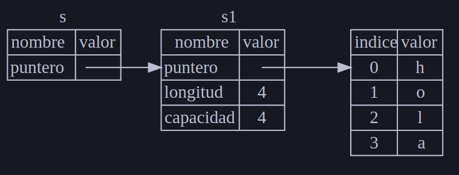

# rust_course

* Podemos crear un proyecto usando `cargo new`.
* Podemos construir un proyecto usando `cargo build`.
* Podemos construir y ejecutar un proyecto en un solo paso usando `cargo run`.
* Podemos construir un proyecto sin producir un binario para verificar errores usando `cargo check`.
* En lugar de guardar el resultado de la compilación en el mismo directorio que nuestro código, Cargo lo almacena en el directorio `target/debug`.
* Cuando tu proyecto finalmente esté listo para su lanzamiento, puedes usar `cargo build --release` para compilarlo con optimizaciones.


## Mutabilidad

https://book.rustlang-es.org/ch03-01-variables-and-mutability

Cuando una variable es inmutable, una vez que un valor está vinculado a un nombre, no puede cambiar ese valor. 

Primero, no se le permite usar mut con constantes. Las constantes no son solo inmutables por defecto, siempre son inmutables. Declara constantes usando la palabra clave const en lugar de la palabra clave let, y el tipo del valor debe estar anotado

### Shadowing

En Rust, shadowing es una característica que permite declarar una nueva variable con el mismo nombre que una variable anterior. La nueva variable "sombrea" a la anterior, lo que significa que la variable anterior deja de estar accesible en el ámbito actual. Esto puede ser útil para transformar el valor de una variable sin tener que crear un nuevo nombre.

El Shadowing es diferente de marcar una variable como mut porque obtendremos un error de tiempo de compilación si accidentalmente intentamos volver a asignar esta variable sin usar la palabra clave let. Al usar let, podemos realizar algunas transformaciones en un valor, pero la variable debe ser inmutable después de que se hayan completado esas transformaciones.

La otra diferencia entre mut y el shadowing es que, debido a que efectivamente estamos creando una nueva variable cuando usamos la palabra clave let nuevamente, podemos cambiar el tipo de valor pero reutilizar el mismo nombre. Por ejemplo, digamos que nuestro programa le pide al usuario que muestre cuántos espacios desea entre algún texto ingresando caracteres de espacio, y luego queremos almacenar esa entrada como un número:

```rust
let spaces = "   ";
let spaces = spaces.len();
```

La primera variable spaces es de tipo string y la segunda variable spaces es de tipo numérico. El shadowing nos ahorra tener que pensar en nombres diferentes, como spaces_str y spaces_num; en su lugar, podemos reutilizar el nombre más simple spaces. Sin embargo, si intentamos usar mut para esto, como se muestra aquí, obtendremos un error de tiempo de compilación:

```rust
// Error
let mut spaces = "   ";
spaces = spaces.len();

```

## Tipos de datos
https://book.rustlang-es.org/ch03-02-data-types

Cada valor en Rust es de un cierto tipo de dato, que le dice a Rust qué tipo de dato se está especificando para que sepa cómo trabajar con ese dato. Veremos dos subconjuntos de tipos de datos: escalares y compuestos.

Tenga en cuenta que Rust es un lenguaje estáticamente tipado, lo que significa que debe conocer los tipos de todas las variables en tiempo de compilación. 

### Tipos Escalares
Un tipo escalar representa un solo valor. Rust tiene cuatro tipos escalares principales: enteros, números de coma flotante, booleanos y caracteres. Puede reconocerlos de otros lenguajes de programación. Vamos a ver cómo funcionan en Rust.

#### Tipos de Enteros
El tipo u32. Esta declaración de tipo indica que el valor con el que está asociado debe ser un entero sin signo (los tipos de enteros con signo comienzan con i en lugar de u) que ocupa 32 bits de espacio. La tabla 3-1 muestra los tipos de enteros integrados en Rust. Podemos usar cualquiera de estas variantes para declarar el tipo de un valor entero.

| Tamaño  | Signed | Unsigned |
|---------|--------|----------|
| 8-bit   | i8     | u8       |
| 16-bit  | i16    | u16      |
| 32-bit  | i32    | u32      |
| 64-bit  | i64    | u64      |
| 128-bit | i128   | u128     |
| arch    | isize  | usize    |

* Signed integers (i8, i16, i32, i64, i128) can represent both positive and negative numbers.
* Unsigned integers (u8, u16, u32, u64, u128) can only represent positive numbers.
* The "arch" row refers to integers whose size is dependent on the architecture of the computer (e.g. 32-bit or 64-bit). isize and usize are signed and unsigned integers, respectively, that are the same size as a pointer on the target platform.
* Cada variante con signo puede almacenar números de -(2n - 1) a 2n - 1 - 1, donde n es el número de bits que usa la variante. Así, un i8 puede almacenar números de -(27) a 27 - 1, lo que equivale a -128 a 127. Las variantes sin signo pueden almacenar números de 0 a 2n - 1, por lo que un u8 puede almacenar números de 0 a 28 - 1, lo que equivale a 0 a 255.

#### Tipos de coma flotante
Rust también tiene dos tipos primitivos para números de coma flotante, que son números con comas decimales. Los tipos de coma flotante de Rust son f32 y f64, que tienen 32 bits y 64 bits de tamaño, respectivamente. El tipo predeterminado es f64 porque en CPUs modernas, es aproximadamente la misma velocidad que f32 pero es capaz de más precisión. Todos los tipos de coma flotante son con signo.

#### Tipos Booleanos
Como en la mayoría de los otros lenguajes de programación, un tipo booleano en Rust tiene dos posibles valores: true y false. Los booleanos tienen un byte de tamaño. El tipo booleano en Rust se especifica usando bool.

#### El tipo de carácter
El tipo char de Rust es el tipo alfabético más primitivo del lenguaje.

Tenga en cuenta que especificamos literales char con comillas simples, en oposición a literales de cadena, que usan comillas dobles. El tipo char de Rust tiene un tamaño de cuatro bytes y representa un valor escalar Unicode, lo que significa que puede representar mucho más que ASCII. Letras acentuadas; Caracteres chinos, japoneses y coreanos; Emojis; y espacios de ancho cero son todos valores char válidos en Rust. Los valores escalar de Unicode van desde U+0000 a U+D7FF y U+E000 a U+10FFFF inclusive. Sin embargo, un "carácter" no es realmente un concepto en Unicode, por lo que su intuición humana sobre lo que es un "carácter" puede no coincidir con lo que es un char en Rust. 

### Tipos compuestos
Tipos compuestos pueden agrupar múltiples valores en un solo tipo. Rust tiene dos tipos compuestos primitivos: tuplas y arreglos.

#### El Tipo Tupla
Una tupla es una forma general de agrupar varios valores de distintos tipos en un tipo compuesto. Las tuplas tienen una longitud fija: una vez declaradas, su tamaño no puede aumentar ni disminuir.

Creamos una tupla escribiendo una lista de valores separados por comas dentro de paréntesis. Cada posición de la tupla tiene un tipo, y los tipos de los distintos valores de la tupla no tienen por qué ser iguales. 

### El Tipo Arreglo
Otra forma de tener una colección de múltiples valores es con un arreglo. A diferencia de una tupla, cada elemento de un arreglo debe tener el mismo tipo. A diferencia de los arreglos en algunos otros lenguajes, los arreglos en Rust tienen una longitud fija.

## Funciones
https://book.rustlang-es.org/ch03-03-how-functions-work

El código en Rust usa snake case como estilo convencional para los nombres de funciones y variables, en el que todas las letras son minúsculas y los guiones bajos separan las palabras.

A Rust no le importa dónde definas tus funciones, sólo que estén definidas en algún lugar en un ámbito que pueda ser visto por el invocador.

```rust
fn main() {
    println!("Hello, world!");

    another_function();
}

fn another_function() {
    println!("Another function.");
}

```

### Parámetros
Podemos definir funciones para que tengan parámetros, que son variables especiales que forman parte de la firma de una función. Cuando una función tiene parámetros, puedes proporcionarle valores concretos para esos parámetros. Técnicamente, los valores concretos se llaman argumentos, pero coloquialmente, la gente tiende a usar las palabras parámetro y argumento indistintamente para las variables en la definición de una función o los valores concretos que se pasan cuando llamas a una función.

```rust
fn main() {
    another_function(5);
}

fn another_function(x: i32) {
    println!("The value of x is: {x}");
}
```

### Sentencias y Expresiones
Los cuerpos de las funciones están compuestos por una serie de sentencias opcionalmente terminadas en una expresión. 

* **Sentencias** son instrucciones que realizan alguna acción y no devuelven un valor.
* **Expresiones** evalúan a un valor resultante. Veamos algunos ejemplos.

La sentencia ```let y = 6``` no devuelve un valor, por lo que no hay nada a lo que x se pueda vincular. Esto es diferente a lo que ocurre en otros lenguajes, como C y Ruby, donde la asignación devuelve el valor de la asignación. En esos lenguajes, puedes escribir ```x = y = 6``` y hacer que tanto x como y tengan el valor 6; eso no es el caso en Rust.

### Funciones con valores de retorno
Las funciones pueden devolver valores al código que las llama. No nombramos los valores de retorno, pero debemos declarar su tipo después de una flecha (->). En Rust, el valor de retorno de la función es sinónimo del valor de la última expresión en el bloque del cuerpo de una función. Puedes devolver un valor antes de que la función finalice utilizando la palabra clavereturn y especificando un valor, pero la mayoría de las funciones devuelven la última expresión implícitamente.

## Flujo de Control
https://book.rustlang-es.org/ch03-05-control-flow
La capacidad de ejecutar algún código dependiendo de si una condición es true y ejecutar algún código repetidamente mientras una condición es true son elementos básicos en la mayoría de los lenguajes de programación. Las construcciones más comunes que le permiten controlar el flujo de ejecución del código Rust son las expresiones if y los bucles.

### Expresiones if
Una expresión if le permite dividir su código según las condiciones. Proporciona una condición y luego dice: “Si se cumple esta condición, ejecute este bloque de código. Si la condición no se cumple, no ejecute este bloque de código.”

```rust
fn main() {
    let number = 3;

    if number < 5 {
        println!("condition was true");
    } else {
        println!("condition was false");
    }
}
```

### Repetición con bucles
A menudo es útil ejecutar un bloque de código más de una vez. Para esta tarea, Rust proporciona varios bucles, que ejecutarán el código dentro del cuerpo del bucle hasta el final y luego comenzarán de inmediato desde el principio. Para experimentar con los bucles, hagamos un nuevo proyecto llamado loops.

Rust tiene tres tipos de bucles: loop, while y for. Vamos a probar cada uno.

#### Repetir código con loop
La palabra clave loop le dice a Rust que ejecute un bloque de código una y otra vez para siempre o hasta que le indique explícitamente que se detenga.

bucle infinito:

```rust
fn main() {
    loop {
        println!("again!");
    }
}
```

## Ownership

https://book.rustlang-es.org/ch04-01-what-is-ownership

El ownership es un conjunto de reglas que definen cómo un programa de Rust administra la memoria. Todos los programas tienen que administrar la forma en que usan la memoria de un computador mientras se ejecutan. Algunos lenguajes tienen recolección de basura que busca regularmente la memoria que ya no se usa mientras el programa se ejecuta; en otros lenguajes, el programador debe asignar y liberar la memoria explícitamente. Rust usa un tercer enfoque: la memoria se administra a través de un sistema de ownership con un conjunto de reglas que el compilador verifica. Si alguna de las reglas se viola, el programa no se compilará. Ninguna de las características del ownership ralentizará su programa mientras se ejecuta.

#### Nota
La traducción de Ownership seria "Propiedad", la mayor parte de la comunidad habla de este sistema como Ownsership pero también es valido este termino. El motivo es que el sistema de ownership es solo una analogía.

La analogía es que el ownership es como la propiedad de un objeto, por ejemplo si tienes un libro, el libro es tuyo. Si lo prestas a alguien, el libro sigue siendo tuyo, pero ahora el libro esta en posesión de otra persona. Cuando te devuelven el libro, el libro regresa a tu posesión.

### El Stack y el Heap

#### Stack

Tanto el stack como el heap son partes de la memoria disponible para su código para usar en tiempo de ejecución, pero están estructurados de formas diferentes. El stack almacena valores en el orden en que los recibe y elimina los valores en el orden opuesto. Esto se conoce como LIFO que es el acrónimo inglés de Last In, First Out o en español El último en entrar, es el primero en salir. Piense en una pila de platos: cuando agrega más platos, los coloca en la parte superior de la pila, y cuando necesita un plato, toma uno de la parte superior. Agregar o eliminar platos del medio o de la parte inferior no funcionaría tan bien! Agregar datos se llama empujar en el stack, y eliminar datos se llama sacar del stack. Todos los datos almacenados en el stack deben tener un tamaño conocido y fijo. Los datos con un tamaño desconocido en tiempo de compilación o un tamaño que puede cambiar deben almacenarse en el heap en su lugar.

```rust
fn main() {
    let x = 42; // 'x' se almacena en el Stack
    println!("El valor de x es: {}", x);
}

```

#### Heap

El heap es menos organizado: cuando coloca datos en el heap, solicita una cierta cantidad de espacio. El administrador de memoria encuentra un lugar vacío en el heap que sea lo suficientemente grande, lo marca como en uso y devuelve un puntero, que es la dirección de esa ubicación. Este proceso se llama asignar en el heap y a veces se abrevia como solo asignar (empujar valores en el stack no se considera asignar). Debido a que el puntero al heap es un tamaño conocido y fijo, puede almacenar el puntero en el stack, pero cuando desea los datos reales, debe seguir el puntero. Piense en estar sentado en un restaurante. Cuando ingresa, indica la cantidad de personas en su grupo, y el anfitrión encuentra una mesa vacía que quepa a todos y los lleva allí. Si alguien en su grupo llega tarde, puede preguntar dónde se ha sentado para encontrarlo.

En resumen, el Stack es ideal para datos de tamaño fijo y de vida corta, mientras que el Heap es más adecuado para datos dinámicos y de vida más larga.

```rust
fn main() {
    let y = Box::new(42); // 'y' es un puntero a un valor en el Heap
    println!("El valor de y es: {}", y);
}

```

### Reglas de Ownership
Primero, echemos un vistazo a las reglas de ownership. Mantenga estas reglas en mente mientras trabajamos a través de los ejemplos que las ilustran:

* Cada valor en Rust tiene un propietario.
* Solo puede haber un propietario a la vez.
* Cuando el propietario sale del alcance, el valor se descartará.

### Ámbito de las Variables
La variable ```s``` se refiere a un literal de cadena, donde el valor de la cadena está codificado en el texto de nuestro programa. La variable es válida desde el punto en que se declara hasta el final del contexto de ejecución actual. A continuación se muestra un programa con comentarios que anotan dónde sería válida la variable s.

```rust
{                      // s no es valido aquí, aún no está declarado
    let s = "hola";   // s es valido desde aquí

    // Hacer algo con s
}                      // este ámbito termina aquí, s ya no es valido
```

### Referencias y Prestamos
https://book.rustlang-es.org/ch04-02-references-and-borrowing

El simbolo ```&``` se usa para referencias. Una referencia es un puntero a un valor, pero no lo puede modificar. Por ejemplo:

```rust
fn main() {
    let s1 = String::from("hola");

    let len = calcular_longitud(&s1);

    println!("La longitud de '{s1}' es {len}.");
}

fn calcular_longitud(s: &String) -> usize {
    s.len()
}
```
La sintaxis &s1 nos permite crear una referencia que se refiere al valor de s1 pero sin ser el propietario. Por este motivo, el valor al que apunta no se descartará cuando la referencia deje de usarse.




### Referencias Mutables

Estas referencias permiten que el valor que se esta prestando pueda ser modificado, pero con las restriccion que solo se puede hacer una vez, solo sepuede modificar la referencia una vez.

La restricción que impide múltiples referencias mutables a los mismos datos al mismo tiempo permite la mutación pero de una manera muy controlada. Es algo con lo que los nuevos en Rust luchan porque la mayoría de los lenguajes te permiten mutar cuando quieras. El beneficio de tener esta restricción es que Rust puede prevenir las carreras de datos en tiempo de compilación. Una carrera de datos es similar a una condición de carrera y ocurre cuando ocurren estos tres comportamientos:

* Dos o más punteros acceden a los mismos datos al mismo tiempo.
* Al menos uno de los punteros se está utilizando para escribir en los datos.
* No hay ningún mecanismo que se esté utilizando para sincronizar el acceso a los datos.

### Referencias colgantes

En lenguajes con punteros, es fácil crear accidentalmente un puntero colgante: un puntero que hace referencia a una ubicación en la memoria que puede haber sido otorgada a otra persona, al liberar algo de memoria mientras se preserva un puntero a esa memoria. En Rust, por el contrario, el compilador garantiza que las referencias nunca serán referencias colgantes: si tiene una referencia a algún dato, el compilador asegurará que los datos no salgan de contexto de ejecución antes de que la referencia a los datos lo haga.

### El tipo Slice
https://book.rustlang-es.org/ch04-03-slices
Los Slices te permiten referenciar a una secuencia contigua de elementos en una colección en lugar de la colección completa. Un slice es una especie de referencia, por lo que no tiene ownership.

Recordemos ejemplos de colecciones:

* Un vector le permite almacenar un número variable de valores uno al lado del otro.
* Un string es una colección de caracteres. Hemos mencionado el tipo String anteriormente, pero en este capítulo hablaremos de él en profundidad.
* Un hash map le permite asociar un valor con una clave especifica. Es una implementación particular de la estructura de datos más general llamada map.

Los slices permiten acceder a una porción de datos sin necesidad de copiarla.

**Ventajas de Usar Slices**

* Eficiencia: No se copia el string completo, solo se crea una referencia a una parte del string.
* Seguridad: Rust garantiza que los slices siempre sean válidos mientras el string original no sea modificado.

### Structs
https://book.rustlang-es.org/ch05-01-defining-structs

Como en las tuplas, las partes de un struct pueden ser de diferentes tipos. A diferencia de las tuplas, en un struct tú nombras a cada pieza de datos para que quede claro, que significan estos valores. Agregando estos nombres significa que los structs son más flexibles que las tuplas: no tienes que confiar en el orden de los datos para especificar o acceder a los valores de una instancia.

Para definir un struct, debemos usar la palabra clave struct y el nombre del struct completo. El nombre del struct debe describir el significado de los datos que se agrupan. Entonces, entre llaves, definimos los nombres y tipos de datos, que llamaremos campos. 

**Ejemplo struct**
```rust
struct User {
    active: bool,
    username: String,
    email: String,
    sign_in_count: u64,
}
```

Para usar un struct después de haberlo definido, creamos una instancia de ese struct especificando valores concretos para cada uno de los campos. Creamos una instancia al declarar el nombre del struct y luego agregar llaves que contienen clave: valor pares, donde las claves son los nombres de los campos y los valores son los datos que queremos almacenar en esos campos. No tenemos que especificar los campos en el mismo orden en el que los declaramos en el struct. En otras palabras, la definición del struct es como una plantilla general para el tipo, y las instancias llenan esa plantilla con datos particulares para crear valores del tipo.

```rust
fn main() {
    let user1 = User {
        active: true,
        username: String::from("someusername123"),
        email: String::from("someone@example.com"),
        sign_in_count: 1,
    };
}
```
Tambien se pueden crear struct sin nombres de campos, pero no se recomienda hacerlo, ya que se puede confundir con la tupla.

```rust
struct Color(i32, i32, i32);
struct Point(i32, i32, i32);

fn main() {
    let black = Color(0, 0, 0);
    let origin = Point(0, 0, 0);
}
```
Ejercicio de structs en **rectangles**